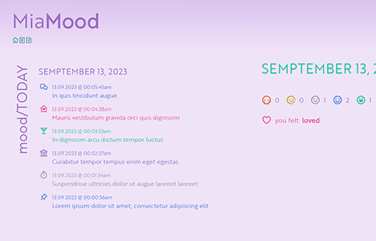
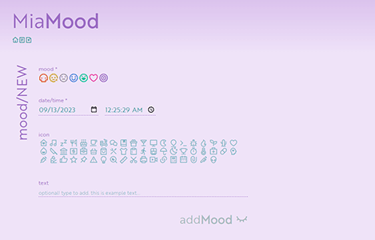

This page is in  English.
Para visualizar essa página em  Português, [clique aqui](./README-ptbr.md).

---

#  MiaMood - Mood Tracker


A tool used to keep a record of one's mood, ideally at regular intervals. The purpose of this kind of tool is to help identify patterns in how moods change over time and due to different situations and circumstances.

## 🔗 Demo

- [miamood-01.fly.dev](https://miamood-01.fly.dev/)

## 🟰 Table of Contents

<details open>
<summary>expand / collapse</summary>
&nbsp;

- [Technologies](#-technologies)
- [Screenshots](#%EF%B8%8F-screenshots)
- [Color Reference](#-color-reference)
- [Install and Run](#%EF%B8%8F-install-and-run)
- [Authors](#-authors)
- [Acknowledgements](#-acknowledgements)

</details>

## 🧮 Technologies

- Node.js
- Express
- EJS
- Sequelize
- PostgreSQL

## 🖼️ Screenshots

<details open>
<summary>expand / collapse</summary>
&nbsp;

[](assets/img/screenshot-01.png)

[](assets/img/screenshot-02.png)

</details>

## 🍭 Color Reference

<details open>
<summary>expand / collapse</summary>
&nbsp;

|                            Icon                            |  Mood   |                                                     | Hex     |
| :--------------------------------------------------------: | :-----: | --------------------------------------------------- | ------- |
|                   |   bad   |  | #e25b2d |
|            | not ok  |  | #cd9f0c |
|  |   meh   |  | #a296ad |
|           |   ok    |  | #4483db |
|        |  yeah!  |  | #03c599 |
|                 |  loved  |  | #ea3ba7 |
|               | neutral |  | #9b6cc4 |

</details>

## ⚙️ Install and Run

<details open>
<summary>expand / collapse</summary>
&nbsp;

Clone the project

```bash
> git clone https://github.com/miaslls/MiaMood-MoodTracker.git
```

Go to the project directory

```bash
> cd MiaMood-MoodTracker
```

Install dependencies

```bash
> npm install
```

Run the project

```bash
> npm run start
```

</details>

## 👩‍💻 Authors

- [@miaslls](https://www.github.com/miaslls)

## 📑 Related Projects

- [MiaMood](https://github.com/miaslls/MiaMood)

## 🫶 Acknowledgements

- [@acaua](https://www.github.com/acaua)
- [Remix Icon](https://remixicon.com/)
